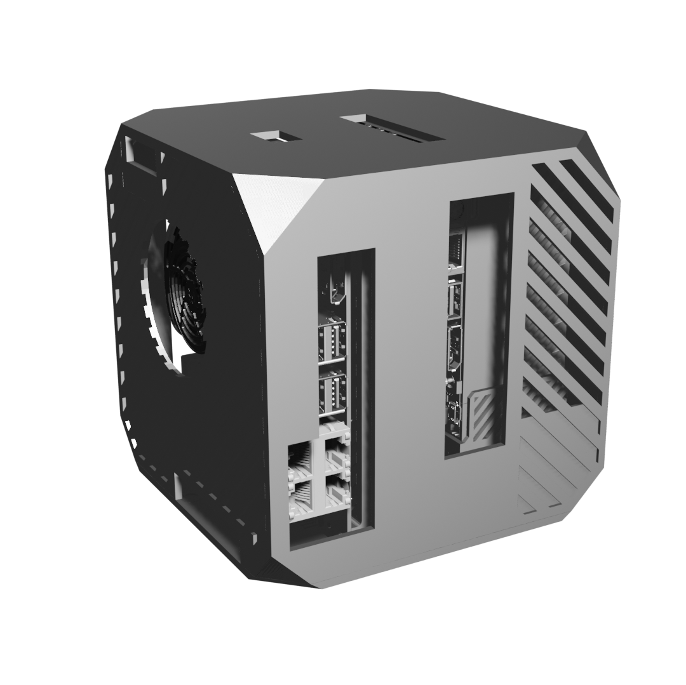
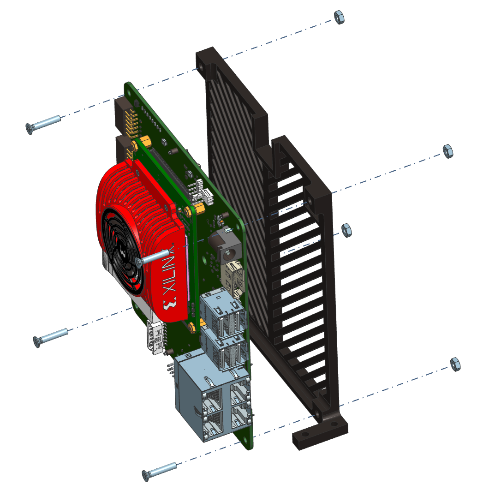
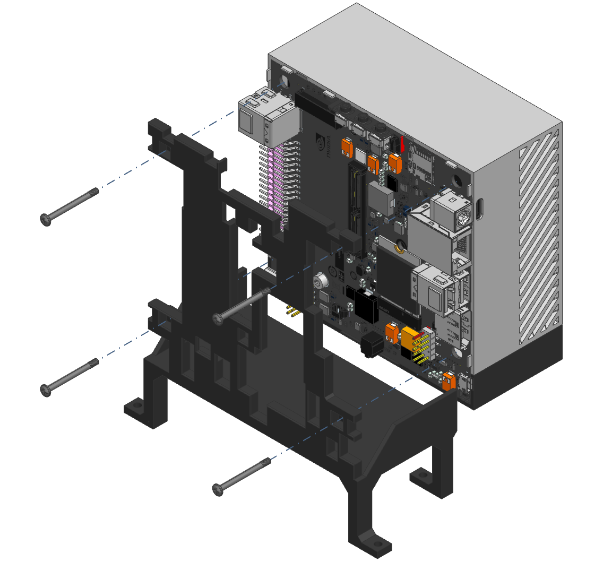
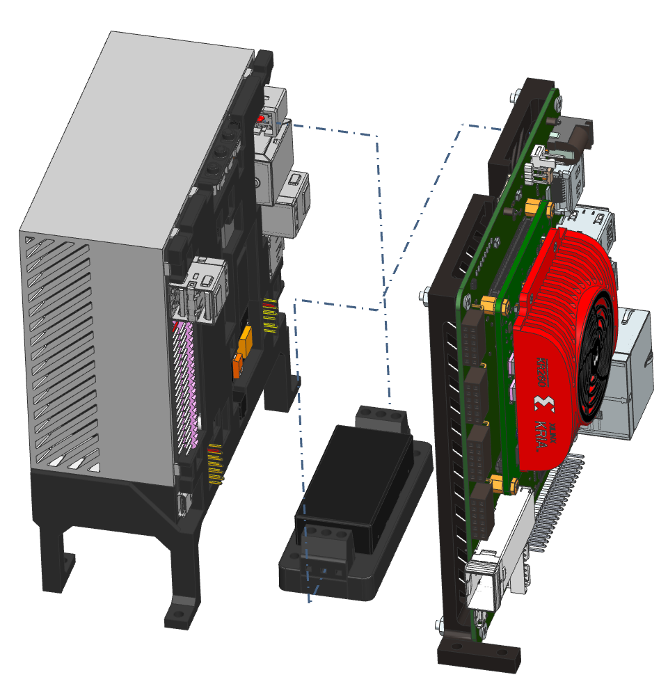
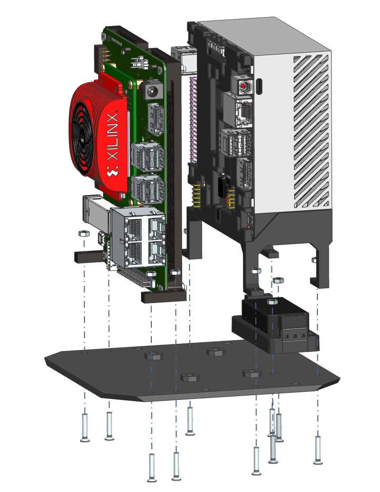
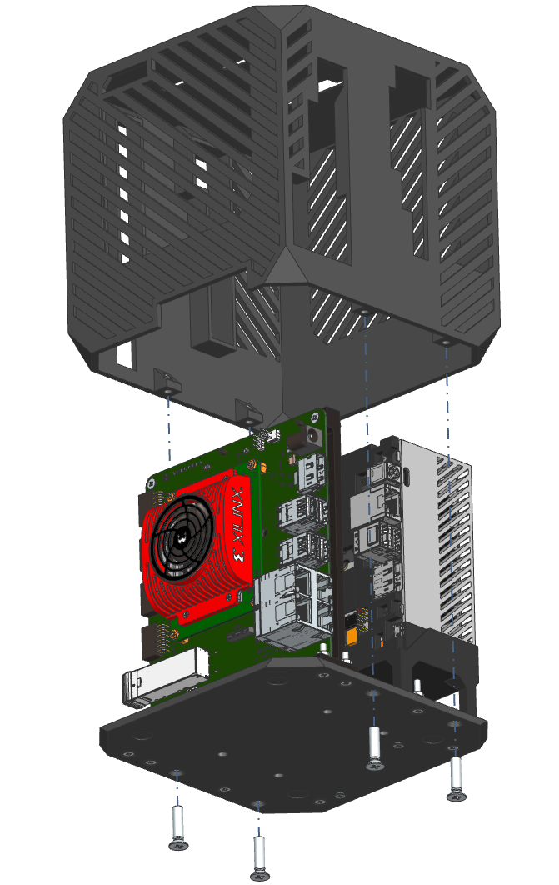
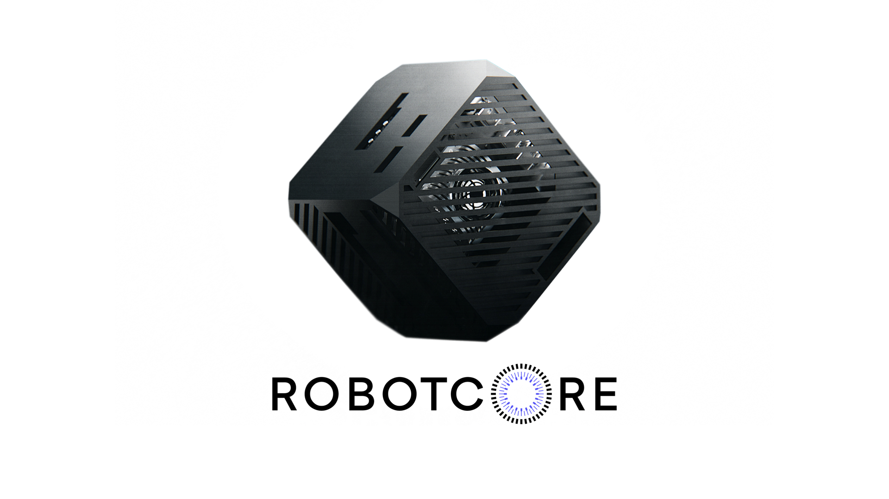

# Robotic Processing Unit

The Robotic Processing Unit (`RPU`[^2]) is a <ins>robot-specific processing unit that uses hardware acceleration and maps robotics computations efficiently to its CPUs, FPGAs and GPUs to obtain best performance</ins>. In particular, it specializes in improving the **Robot Operating System (ROS 2)** related robot computational graphs on underlying compute resources.

- [Robotic Processing Unit](#robotic-processing-unit)
  - [Sponsoring the project](#sponsoring-the-project)
  - [Goal](#goal)
      - [Vision](#vision)
      - [Milestones](#milestones)
  - [Build a Robotic Processing Unit](#build-a-robotic-processing-unit)
      - [BOM](#bom)
      - [Assembly instructions](#assembly-instructions)
  - [Buy a Robotic Processing Unit](#buy-a-robotic-processing-unit)
  - [Commercial Support](#commercial-support)

## Sponsoring the project

*This project was originally sponsored by [Acceleration Robotics](https://accelerationrobotics.com/) and driven by the [ROS 2 Hardware Acceleration Working Group](https://github.com/ros-acceleration). We are open to additional sponsorships and collaborations. [Contact here for sponsoring](mailto:victor@accelerationrobotics.com) the Robotic Processing Unit (`RPU`) project. For commercial support regarding Robotic Processing Units, [get commercial support here](https://accelerationrobotics.com/start-buying.php). If you're looking to buy a fully assembled unit, [buy a Robotic Processing Unit here](#buy-a-robotic-processing-unit). Or instead, [build your own Robot Processing Unit here](#build-a-robotic-processing-unit)*.

#### Press coverage
- [Acceleration Robotics announce and open sources ROBOTCORE®, the first Robotic Processing Unit – specialized in ROS computations](https://news.accelerationrobotics.com/acceleration-robotics-collaborating-with-amd-to-design-next-generation-robotic-compute-architectures-with-ros)

## Goal
Robotic Processing Units (RPUs) are robot brains, processing units for robots that map efficiently robot behaviors (programmed as ROS computational graphs) to underlying compute resources. They empower robots with the ability to <ins>react faster</ins>, consume <ins>less power</ins>, and deliver <ins>additional real-time</ins> capabilities.

The goal of this project is to provide robotic architects a reference hardware blueprint for building hardware accelerated robotic brains. To do so, the project leverages *existing off-the-shelf* hardware acceleration development platforms will be used to prototype a robot-specific processing unit that performs best when it comes to ROS 2 and robot computational graphs.

#### Vision
The vision is that Robotic Processing Units will empower robots with the ability to react faster (*lower latency*, higher throughput), consume less power, and deliver additional real-time capabilities with their custom compute architectures that fit best the usual robotics pipelines. This includes tasks across *sensing, perception, mapping, localization, motion control, low-level control and actuation*.

#### Milestones

**Milestone 1: first demonstrators** - *raise awareness*
- [x] [Robotic Processing Unit (`RPU`) project announcement](https://news.accelerationrobotics.com/hardware-accelerated-ros2-pipelines/#new-subproject-robotic-processing-unit-rpu)
- [x] RFC to receive feedback and interest https://forms.gle/d4rCCoLpx9ciPiau9
- [x] Use cases driving the architecture and the development
  - [x] Perception (`image_pipeline` and friends)
    - [x] [`perception_2nodes`](https://github.com/ros-acceleration/acceleration_examples/tree/main/graphs/perception/perception_2nodes)
    - [x] [`perception_3nodes`](https://github.com/ros-acceleration/acceleration_examples/tree/main/graphs/perception/perception_3nodes)
    - [ ] *Maybe consider a more elaborated graph with multi-processing paths involving  more complex CV crunching, e.g. HOG (Histogram of Oriented Gradients)*?
  - [ ] Navigation
    - [ ] Still in dicussions, open to feedback.
- [ ] Partition work into demonstrators, prioritize and execute
- [ ] (...)

## Build a Robotic Processing Unit

You can build your own Robotic Processing Unit by purchasing each individual part and 3D printing the corresponding [mechanical parts](mechanical/).
#### BOM
| Part | Quantity | 
|------|----------|
| [`Base` (*mechanical part*)](mechanical/robotic_processing_unit_base.stl) | 1 |
| [`Cover` (*mechanical part*)](mechanical/robotic_processing_unit_cover.stl) | 1 |
| [`KR260 adapter` (*mechanical part*)](mechanical/robotic_processing_unit_kr260.stl) | 1 |
| [`AGX Orin adapter` (*mechanical part*)](mechanical/robotic_processing_unit_agx_orin.stl) | 1 |
| Kria `KR260` robotics development kit | 1 |
| Jetson `AGX Orin` developer kit | 1 |
| `PYBE30-Q24-S12-T` DC-DC converter | 1 |
| `M5 bolt` (ISO 7046) | 4 |
| `M3 bolt` (ISO 7046) | 14 |
| `M3 nut` (DIN 934) | 14 |

#### Assembly instructions

| Step | Image | Description |
|------|-------|-------------|
| `0` |  | Here's the exploded view of the Robotic Processing Unit. This should help guide the process of building your own. Start by soldering the power wiring to the `KR260` and `AGX Orin` boards separately. You need to do so on the power jack pins of each one of the robotics development kits[^1].|
| `1` |  |  Screw `KR260` board to `KR260 adapter` with 4x `M3 bolts` (ISO7046) and 4x `M3 nuts` (DIN934).|
| `2` |  | Screw `AGX Orin` board to `AGX Orin adapter` with the same original bolts included in the development kit.|
| `3` |  | Connect the previously soldered wires on both dev. boards to the `PYBE30-Q24-S12-T` DC-DC converter. Power input should come from the `AGX Orin` and regulated output to the `KR260`.|
| `4` |  | Screw the `PYBE30-Q24-S12-T` DC-DC converter, the `AGX orin` and the `KR260` to the `Base`. Use 10x `M3 bolts` (ISO7046) and 10x `M3 nuts` (DIN934). |
| `5` |  | Finally, fix the 4 holes of the cover and join the base and cover with 4x `M5 bolts` (ISO7046). |

## Buy a Robotic Processing Unit

[ROBOTCORE®](https://accelerationrobotics.com/robotcore.php) is a commercial solution of a robot-specific processing unit that helps map Robot Operating System (ROS) computational graphs to its CPUs, GPU and FPGA efficiently to obtain best performance. It empowers robots with the ability to react faster, consume less power, and deliver additional real-time capabilities. ROBOTCORE can be purchased [here](https://accelerationrobotics.com/robotcore.php).

With ROBOTCORE®, Acceleration Robotics offers also the following  ROS 2 API-compatible hardware acceleration tools and robot Intellectual Property (IP) cores (`robot cores`):

- [ROBOTCORE® `Framework`](https://accelerationrobotics.com/robotcore-framework.php), a hardware acceleration framework for ROS and ROS 2.
- [ROBOTCORE® `Cloud`](https://accelerationrobotics.com/robotcore-cloud.php), tools to speed-up ROS 2 graphs with the cloud, and in the cloud.
- [ROBOTCORE® `Perception`](https://accelerationrobotics.com/robotcore-perception.php), accelerated ROS 2 robotics perception stack. ROS 2-API compatible with default perception stack.
- [ROBOTCORE® `Transform`](https://accelerationrobotics.com/robotcore-transform.php), accelerated ROS 2 coordinate transformations (`tf2`). ROS 2-API compatible with default `tf2`.

## Commercial Support

For commercial support while building on top of the Robotic Processing Unit project, [reach out here](https://accelerationrobotics.com/start-buying.php).

[^1]: You'll need to unscrew AGX Orin's 4 outer bolts and extract aluminum lower support to solder it properly.

[^2]: We're very aware that the RPU acronym is overloaded and also used to refer to other types of processing units including *Remote Processing Unit*, *Ray Processing Unit*, *Real-time Processing Unit*, *Radio Processing Unit*, *Regional Processing Unit* or *RAID Processing Unit*  among others. See [comparison for fun](https://trends.google.com/trends/explore?q=Real-time%20Processing%20Unit,Remote%20Processing%20Unit,Ray%20Processing%20Unit,Radio%20Processing%20Unit,Robotic%20Processing%20Unit).
