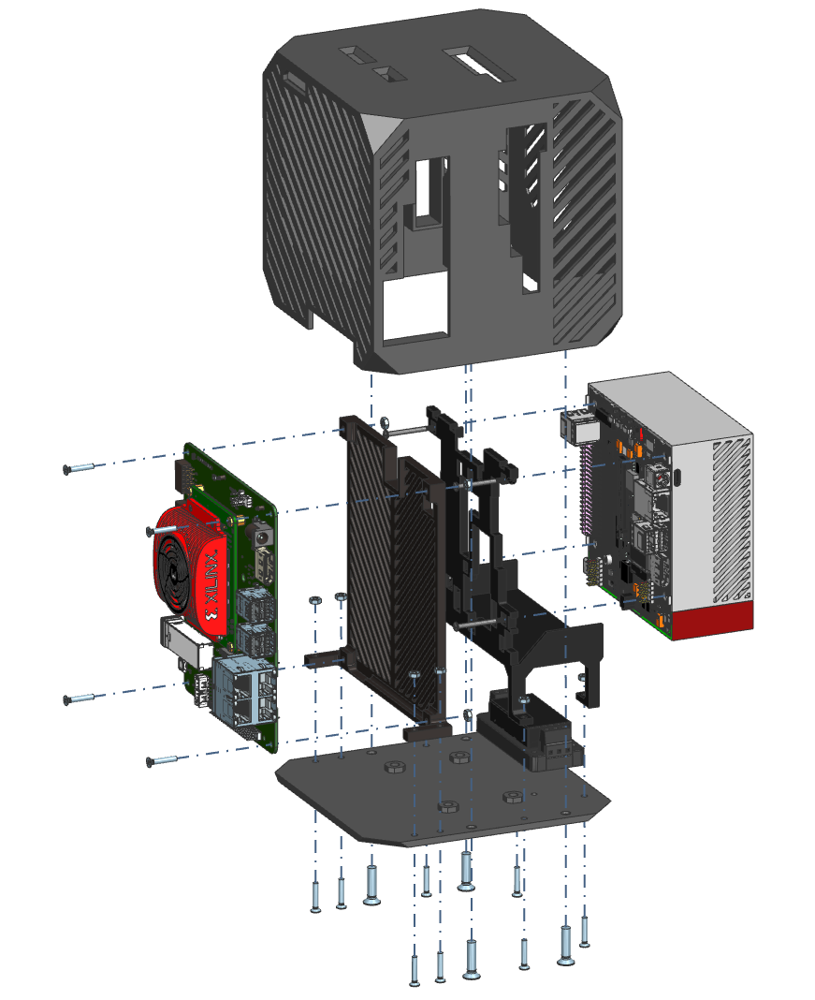

# Robotic Processing Unit

The Robotic Processing Unit (`RPU`) is a <ins>robot-specific processing unit that uses hardware acceleration and maps robotics computations efficiently to CPUs, FPGAs and GPUs</ins>. In particular, it specializes in improving the **Robot Operating System (ROS 2)** related robot computational graphs on underlying compute resources to obtain best performance.

*This project is sponsored by [Acceleration Robotics](https://accelerationrobotics.com/) and driven by the [ROS 2 Hardware Acceleration Working Group](https://github.com/ros-acceleration). We are open to additional sponsorships and collaborations. [Contact here for sponsoring](mailto:victor@accelerationrobotics.com) the Robotic Processing Unit (`RPU`) project. For commercial support regarding Robotic Processing Units, [contact here to get commercial support](https://accelerationrobotics.com/start-buying.php). If you're looking to buy a fully assembled unit, [buy a Robotic Processing Unit here](#buy-a-robotic-processing-unit)*. Or instead, [build your own Robot Processing Unit here](#build-a-robotic-processing-unit).

#### Goal
The goal of this project is to provide robotic architects a reference hardware blueprint for building hardware accelerated robotic brains. To do so, the project leverages *existing off-the-shelf* hardware acceleration development platforms will be used to prototype a robot-specific processing unit that performs best when it comes to ROS 2 and robot computational graphs.

#### Vision
The vision is that Robotic Processing Units will empower robots with the ability to react faster (*lower latency*, higher throughput), consume less power, and deliver additional real-time capabilities with their custom compute architectures that fit best the usual robotics pipelines. This includes tasks across *sensing, perception, mapping, localization, motion control, low-level control and actuation*.

#### Milestones

**Milestone 1: first demonstrators** - *raise awareness*
- [x] [Robotic Processing Unit (`RPU`) project announcement](https://news.accelerationrobotics.com/hardware-accelerated-ros2-pipelines/#new-subproject-robotic-processing-unit-rpu)
- [x] RFC to receive feedback and interest https://forms.gle/d4rCCoLpx9ciPiau9
- [x] Use cases driving the architecture and the development
  - [x] Perception (`image_pipeline` and friends)
    - [x] [`perception_2nodes`](https://github.com/ros-acceleration/acceleration_examples/tree/main/graphs/perception/perception_2nodes)
    - [x] [`perception_3nodes`](https://github.com/ros-acceleration/acceleration_examples/tree/main/graphs/perception/perception_3nodes)
    - [ ] *Maybe consider a more elaborated graph with multi-processing paths involving  more complex CV crunching, e.g. HOG (Histogram of Oriented Gradients)*?
  - [ ] Navigation
    - [ ] Still in dicussions, open to feedback.
- [ ] Partition work into demonstrators, prioritize and execute
- [ ] (...)

## Build a Robotic Processing Unit

#### BOM
| Part | Quantity | Description |
|------|----------|-------------|
| | | |

#### Assembly instructions

| Step | Image | Description |
|------|-------|-------------|
| 0 |  | Here's the exploded view of the Robotic Processing Unit. This should help guide the process of building your own |
| 1 |  |

## Buy a Robotic Processing Unit
...